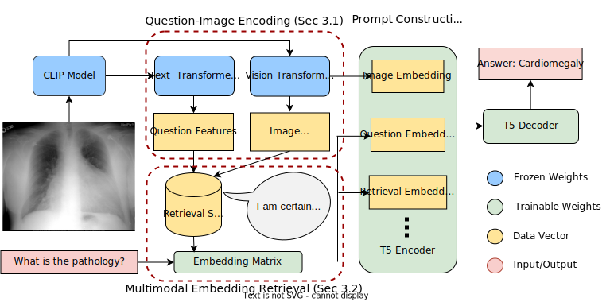

# Retrieving Multimodal Prompts for Medical Visual Question Answering

This repository includes the source code for MPR_Gen, a generative model which optionally integrates visual features or retrieved information into T5 via prompting. This enables rapid zero-shot dataset adaptation to unseen data distributions and open-set answer labels across datasets.




## How to use
### Setup the environment
We use conda version 4.13.0 with python 3.9.12 to conduct our experiments. After creating a fresh anaconda environment with this python version or above, you can install the required libraries to run our code with the following commands:

```
pip install -r requirements.txt
pip install git+https://github.com/openai/CLIP.git
```

### Obtain the data
To reproduce our results, first clone this repository and download the SLAKE dataset from [their website](https://www.med-vqa.com/slake/). Also obtain the image folder, trainset.json, and testset.json files for VQA_RAD from the data folder at [this github repository](https://github.com/Awenbocc/med-vqa). Once the data has been obtained, organize the data into this directory structure (note, VQA_RAD json files should also be renamed to train.json, test.json):

```
data
|----SLAKE
     |----train.json
     |----validate.json
     |----test.json
     |----imgs
          |----xmlab0
          |----xmlab1
                ⋮
|----VQA_RAD
    |----train.json
    |----test.json
    |----imgs
          |----synpic100132.jpg
          |----synpic100176.jpg
                ⋮
```
### Setup the config file
We provide a sample config file in the config folder. You may edit the various entries within it to customize the experiment. Here is a brief explanation of important settings:
```
{
    "dataset":                       # The source dataset used for training (SLAKE or VQA_RAD)
    "datafolder":                    # The path to the folder containing the medical VQA datasets
    "use_image_info":                # 0/1 Indicating whether to use the image features in the prompt
    "T5_version":                    # The size of the T5 model: "t5-small" works best
    "vision_encoder":                # The type of CLIP model: "ViT-B/32" works well
    "vision_checkpoint":             # The path to the saved PubMedCLIP weights
    "use_BAN":                       # 0/1 indicating whether to use BAN for feature fusion (only for prediction head models)
    "use_prediction_head":           # 0/1 indicating whether to use a prediction head or generate free-text answers
    "freeze":                        # 0/1 indicating whether the encoder/decoder stack of T5 should be frozen
    "glimpse":                       # A hyperparameter for BAN
    "retrieval":                     # 0/1 indicating whether the model should do retrieval
    "use_additional_retrieval_data": # 0/1 indicating whether additional synthetic data should be used for retrieval
    "transfer_dataset":              # The Target dataset (SLAKE or VQA_RAD)
    "retrieval_dataset":             # Name of the retrieval dataset (SLAKE, VQA_RAD, or ROCO)
    "k": 1,                          # Number of retrieved question-answer pairs during retrieval
    "quantifier":                    # 0/1 indicating if a quantifier should be used in the retrieved prompts
    "further_finetune":              # 0/1 indicating whether model weights should be updated during adaptation
}

```

### Run main.py
To train a model, execute the following command:
```
python main.py --train --config <path_to_config_file> --gpu_id <ID of GPU>
```
To test a model, use the following:
```
python main.py --test --config <path_to_config_file> --gpu_id <ID of GPU>
```

### Advanced Usage
#### PubMedCLIP Model
We observed mariginal gains for both in-domain and dataset adaptation tasks when using a domain-specific encoder. To reproduce these results, please follow [these instructions](https://github.com/sarahESL/PubMedCLIP/tree/main/PubMedCLIP) and download the PubMedCLIP_ViT32.pth checkpoint. You may then supply the path to these weights in the config file under the vision_checkpoint argument.

#### Synthetic Data
To reproduce the experiments with synthetic data, first download the ROCO dataset following [these instructions](https://github.com/razorx89/roco-dataset) . Then run the generate_roco_questions script from the root project folder as follows:
```
python synthetic_data/generate_roco_questions.py <path_to_ROCO_dataset> <path_to_folder_with_SLAKE_and_VQA_RAD_datasets>
```
This will create a new dataset called ROCO in the same folder as the SLAKE and VQA_RAD datasets. After this step, you can toggle use "ROCO" for the retrieval dataset argument, or optionally toggle the use_additional_data flag in the config file to combine both in-domain and synthetic retrieval data.

### Acknowledgement
We make use of the following repositories to help in our experiments: [OpenAI CLIP](https://github.com/openai/CLIP), [PubMedCLIP](https://github.com/sarahESL/PubMedCLIP), [Medical VQA with Conditional Reasoning](https://github.com/awenbocc/med-vqa)

### Citation
Please feel free to cite our paper if you use our model or results in your research 😊

```bibtex
@article{ossowski2023multimodal,
  title={Multimodal Prompt Retrieval for Generative Visual Question Answering},
  author={Ossowski, Timothy and Hu, Junjie},
  journal={Findings of the 61st Annual Meeting of the Association for Computational Linguistics},
  year={2023}
}
```

